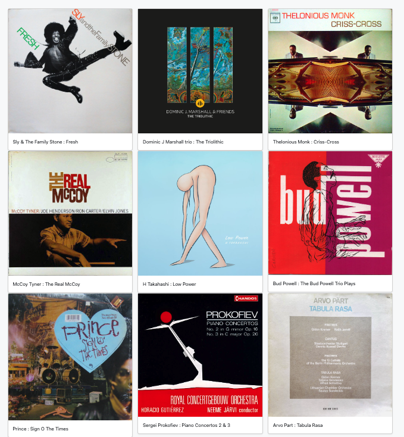
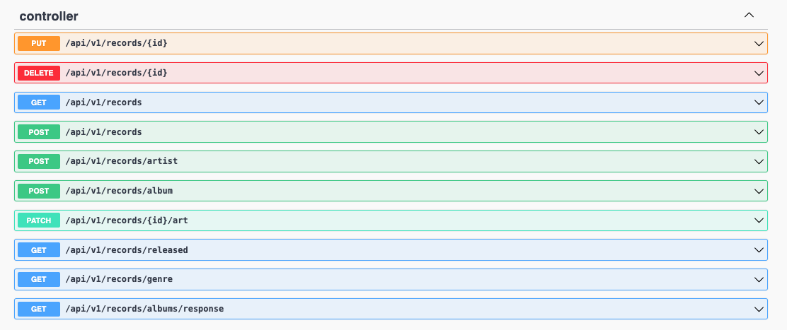

#### RECORD SHOP

A Spring Boot CRUD app for persisting your favourite albums, keeping track of them over time and (optionally) making collaborative lists to share with friends
through GitHub login. This includes a 'front window'-style landing page display.

With this being a full-stack application, I broke it down into the following stages:
- designing the album model
- adding methods for filtering albums by various parameters (genre, name, artist etc) 
- testing each method with Mockito
- implementing the view page with Thymeleaf and Apache Commons
- implementing input validation with jakarta.persistence and Hibernate
- catching all possible exceptions with custom handlers
- adding login protection to the put, patch, post and delete methods.

I didn't overcomplicate the database structure, because I was intent on meeting the goal of the app as stated above.
By organising the packages and classes so that each separate component only had to focus on its particular responsibilities,
I created an app that's easy to understand, use and maintain. Through making extensive use of annotations I
kept my code free of unnecessary bloat. 

I committed regularly throughout the development process, using different branches when I wanted
to try out experimental features like caching. Taking this approach ensured that I never spent too long on any one problem.

It's important for me to be able to visualise what I'm working on, so I'm happy I invested some extra time in learning
about separating collections for the view template, which also gives the user some much-needed context. 

